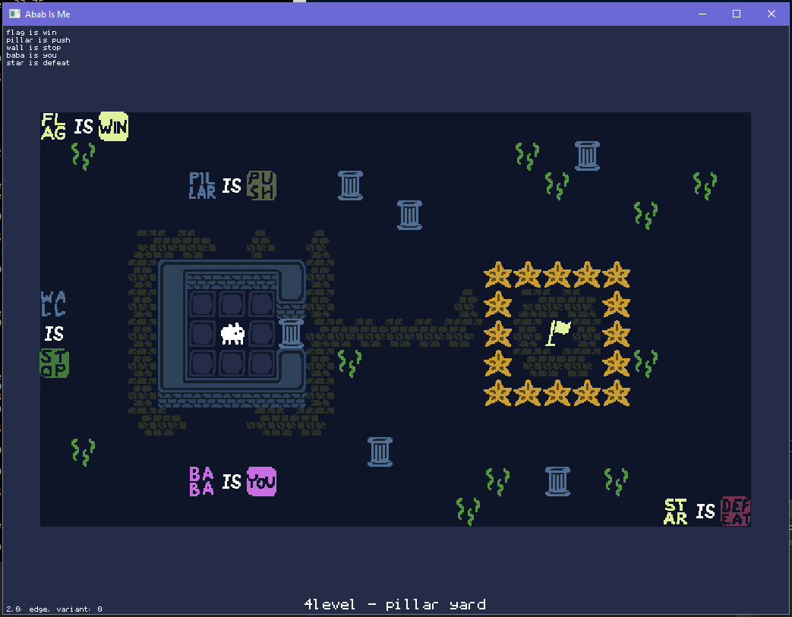

This project aims to be an open source engine for *Baba Is You* puzzle game. The engine should support original level format and will require original game data to be used.

Abab Is Me was born to be compiled on OpenDingux platform but since it's using SDL2 it could be easily ported to any other platform (libretro? RPI?).

The engine is currently able to load levels, render them and handle simple some 3 term rules.

